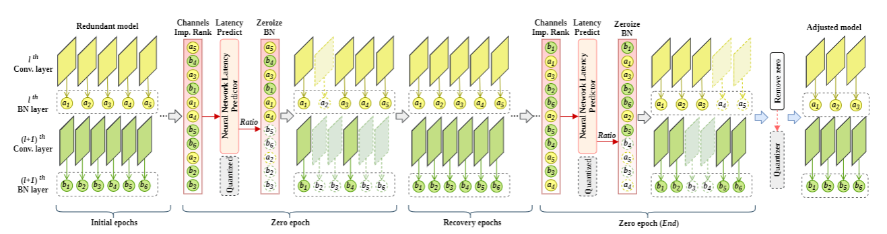

# ZeroBN

This repository contains a pytorch implementation for the latency-critical
neural network adjustment method.


# Dependencies

An [*environment.yml*](environment.yml) has been uploaded for creating a conda environment.

# Dateset
This Cifar 10 dataset will be downloaded automatically by the scripts. And the Imagenet can be 
downloaded from [IMAGENET_2012](https://image-net.org/), and the classes we used are listed in the
[*imagenet100.txt*](imagenet100.txt).


# Cifar 10

```shell
cd Cifar10
python train_cifar10.py -sr --s 0.0001 --dataset cifar10 --arch vgg --depth 19 --our 1 --prune_ratio 0.5 --epochs 160 --save ./logs-vgg
python train_cifar10.py -sr --s 0.00001 --dataset cifar10 --arch resnet --depth 164 --our 1 --prune_ratio 0.5 --epochs 160 --save ./logs-resnet
python train_cifar10.py -sr --s 0.00001 --dataset cifar10 --arch densenet --depth 40 --our 1 --prune_ratio 0.5 --epochs 160 --save ./logs-densenet
```

# ImageNet

```shell
cd ImageNet
python train_imagenet.py -a vgg19_bn --save ./logs-vgg19bn/ --lr 0.01 -sr --ssr 0.001 ../imagenet_100/ --our 1 --prune_ratio 0.5 --epochs 90 --batch-size 128 --auto
python train_imagenet.py -a googlenet --save ./logs-googlenet/ --lr 0.1 -sr --ssr 0.0001 ../imagenet_100/ --our 1 --prune_ratio 0.5 --epochs 90 --batch-size 128 --auto
python train_imagenet_resnetnew.py -a resnet50_new --save ./logs-resnet50new/ --lr 0.1 -sr --ssr 0.0001 ../imagenet_100/ --our 1 --prune_ratio 0.5 --epochs 90 --batch-size 128 --auto
```

# Saved Models
All models that are trained by our method in the paper are publicly accessed at [OneDrive](save_models_link). And you only need to 
add two arguments to the above commands to evaluate these models:
```shell
--resume PATH_TO_CHECKPOINT --evaluate
```


# Latency Predictor

```shell
cd LatPredictor
```
We train a Backpropagation (BP) neural network via Matlab using
the [script](LatPredictor/MatlabTrain/train.m). It will save a *.mat* file and you can
read this *.mat* file by Python (an example is provided in [here](LatPredictor/TorchPredictor/load_mat.py)).

Export the results from the [script](LatPredictor/TorchPredictor/load_mat.py) into
a [latency predictor](LatPredictor/TorchPredictor/predictor.py) written by Pytorch, which can be used
in the training process.

# Tensorflow Support
As Tensorflow is widely used in edge GPU, we also support covert our
model from PyTorch into Tensorflow frozen *.pb* file.

```shell
cd Torch2pb
python trans_vgg19.py --torch_model /path/to/torch_checkpoint/ --save /path/to/savevgg19.pb
python trans_googlenet.py --torch_model /path/to/torch_checkpoint/ --save /path/to/savegooglenet.pb
python trans_resnet.py --torch_model /path/to/torch_checkpoint/ --save /path/to/saveresnet.pb
```

If you want to use quantization, you can refer to the scripts with *_half* to generate a
quantized model.

**The checkpoints saved in Pytorch format still include zeros in the weights, so the models' sizes
are not changed. But our Tensorflow convertor will remove all zeros and the models' sizes become smaller.**

# Results
Please refer to the paper.
